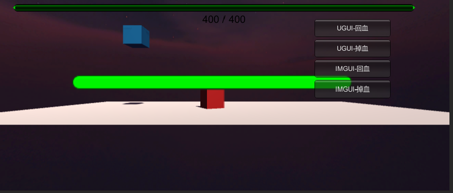

# unity作业-血条

演示视频链接：https://www.bilibili.com/video/BV1tK41167sk/

### 题目


### 场景简介

场景图如下。蓝色物体的血条在最上面，是使用IMGUI来实现的。红色物体的血条在下，是使用UGUI来实现的。




可以通过右边的四个按钮来模拟血量变化的情况。当前血量小于总血量的1/2时，血条将会变为黄色；当前血量小于总血量的1/5时，血条将变成红色。


### 代码与实现

IMGUI和UGUI的血条分别在IMGUI.cs与UGUI.cs中实现。

血条需要有三个参数：最大血量值，当前血量值和单次血量变化量。需要实现两个函数：getHurt和getHeal。前者将血量值减少，后者将血量值增加。

IMGUI的思路是通过OnGUI来将血条显示在固定区域。

IMGUI.cs

```csharp
using System.Collections;
using System.Collections.Generic;
using UnityEngine;

public class IMGUI : MonoBehaviour
{
    public float maxHp;
    public float currentHp;
    public float delta;
    // Start is called before the first frame update
    void Start(){
        maxHp = 400.0f;
        currentHp = maxHp;
        delta = 30.0f;
    }

    // Update is called once per frame
    void Update(){

    }
    public void getHurt(){
        currentHp = currentHp - delta;
        if(currentHp < 0.0f){
            currentHp = 0.0f;
        }
    }
    public void getHeal(){
        currentHp = currentHp + delta;
        if(currentHp >= maxHp){
            currentHp = maxHp;
        }
    }
    /// <summary>
    /// OnGUI is called for rendering and handling GUI events.
    /// This function can be called multiple times per frame (one call per event).
    /// </summary>
    void OnGUI(){
        GUIStyle healthTextStyle = new GUIStyle();
        healthTextStyle.fontSize = 20;
        healthTextStyle.alignment = TextAnchor.MiddleCenter;
        if(currentHp < maxHp * 0.2){
            GUI.color = Color.red;
        }else if(currentHp < maxHp * 0.5){
            GUI.color = Color.yellow;
        }else{
            GUI.color = Color.green;
        }
        GUI.HorizontalScrollbar(new Rect(30, 30, Screen.width - 100, 30), 0.0F, currentHp, 0.0F, maxHp);
        GUI.Label(new Rect(30, 50, Screen.width - 60, 20), currentHp.ToString() + " / " + maxHp.ToString(), healthTextStyle);
    }
}
```

UGUI需要将一个Slider挂载在物体上，然后再将脚本挂载于这个Slider上，然后对Slider进行控制。

UGUI.cs

```csharp
using System.Collections;
using System.Collections.Generic;
using UnityEngine;
using UnityEngine.UI;

public class UGUI : MonoBehaviour
{

    public Slider slider;
    public float maxHp;
    public float delta;
    // Start is called before the first frame update
    void Start() {
        slider.maxValue = maxHp;
        slider.minValue = 0.0f;
        slider.value = slider.maxValue;

    }
    // Update is called once per frame
    void Update() {

        slider.direction = Slider.Direction.LeftToRight;
        slider.transform.rotation = Camera.main.transform.rotation;

        if(slider.value <= 0.3 * slider.maxValue){
            slider.fillRect.transform.GetComponent<Image>().color = Color.red;
        }
        else if(slider.value <= 0.6 * slider.maxValue){
            slider.fillRect.transform.GetComponent<Image>().color = Color.yellow;
        }
        else{
            slider.fillRect.transform.GetComponent<Image>().color = Color.green;
        }
    }

    public void getHurt(){
        slider.value -= delta;
        if(slider.value <= 0){
            slider.value = 0;
        }
    }

    public void getHeal(){
        slider.value += delta;
        if(slider.value >= slider.maxValue){
            slider.value = slider.maxValue;
        }

    }
}
```

totalGUI用于控制系统的总UI。

totalGUI.cs

```csharp
using System.Collections;
using System.Collections.Generic;
using UnityEngine;

public class totalGUI : MonoBehaviour
{
    public IMGUI hpBar1;
    public UGUI hpBar2;


    // Start is called before the first frame update
    void Start(){
        Debug.Log("start");
        gameObject.AddComponent<IMGUI>();
        hpBar1 = singleton<IMGUI>.Instance;
    }

    // Update is called once per frame
    void Update(){

    }

    private void OnGUI(){
        if(GUI.Button(new Rect(0.7f * Screen.width, 180, 150, 35),"IMGUI-掉血")){
            hpBar1.getHurt();
        }
        if (GUI.Button(new Rect(0.7f * Screen.width, 140, 150, 35),"IMGUI-回血")){
            hpBar1.getHeal();
        }
        if (GUI.Button(new Rect(0.7f * Screen.width, 100, 150, 35),"UGUI-掉血")){
            hpBar2.getHurt();
        }
        if (GUI.Button(new Rect(0.7f * Screen.width, 60, 150, 35),"UGUI-回血")){
            hpBar2.getHeal();
        }
    }
}
```

### 配置方法

首先，需要将totalGUI脚本文件拖动到一个空物体（guiCarrier）上。


然后为需要配置UGUI血条的物体配置一个Slider，将UGUI脚本挂载在上面，指定最大血量和每次血量变化值，并将前面的Hp Bar2指定为这个这个Slider。


### IMGUI和UGUI的优缺点分析

IMGUI相对来说是比较简单的一种实现方式，只需要简单的代码就可以完成血条的实现。但是其样式比较单一，且由于是通过onGUI来进行渲染，每一帧都要重新运算，资源消耗大。

UGUI相对来说比较复杂，因为需要单独一个Slider来进行。但是相应的，它可以进行更多的自定义，而且也不需要每一帧都重新加载。
